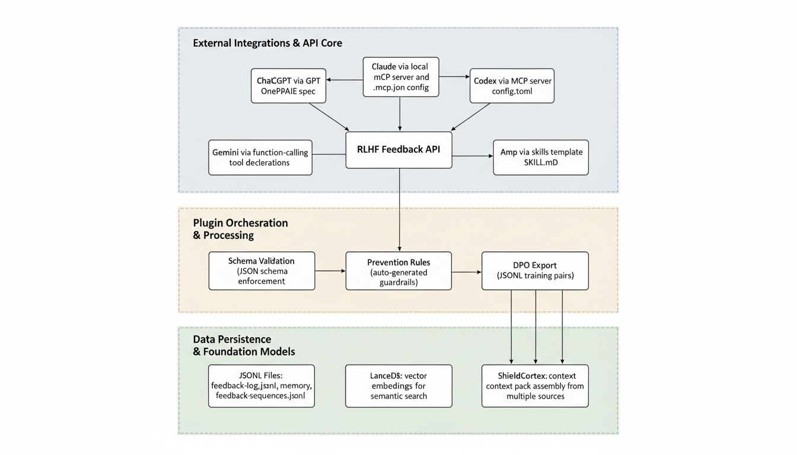

# RLHF Feedback Loop

[](https://github.com/IgorGanapolsky/rlhf-feedback-loop/actions/workflows/ci.yml)
[](https://github.com/IgorGanapolsky/rlhf-feedback-loop/actions/workflows/self-healing-monitor.yml)
[](https://www.npmjs.com/package/rlhf-feedback-loop)
[](LICENSE)
[]()
[](adapters/mcp/server-stdio.js)
[](scripts/export-dpo-pairs.js)

**Make your AI agent learn from mistakes.**

Your AI coding agent makes the same errors over and over. It claims things are done when they're not. It forgets what worked last time. This fixes that.

**rlhf-feedback-loop** captures thumbs up/down feedback on your agent's work, remembers what went right and wrong, blocks repeated failures, and exports training data so the agent actually improves.

Works with **ChatGPT**, **Claude**, **Codex**, **Gemini**, and **Amp** — same core, different adapters.

## Architecture at a Glance

### RLHF Feedback Loop


### Plugin Topology



## Why This Exists

| Problem | What this does |
|---------|---------------|
| Agent keeps making the same mistake | Prevention rules auto-generated from repeated failures |
| No proof agent tested before claiming "done" | Rubric engine blocks positive feedback without test evidence |
| Feedback collected but never used | DPO pairs exported for actual model fine-tuning |
| Different tools, different formats | One API + MCP server works across 5 platforms |

## Install in 60 Seconds

```bash
npm install rlhf-feedback-loop
npx rlhf-feedback-loop init
```

That's it. Your agent now captures feedback, blocks repeated mistakes, and exports training data. Run `npx rlhf-feedback-loop help` for all commands.

## How It Works

1. **Capture** — You (or your agent) gives thumbs up/down with context. Feedback is appended to a local **JSONL** log with tags, rubric scores, and timestamps.

2. **Validate** — The rubric engine scores it and blocks false positives (e.g., agent says "done!" but no tests ran). Invalid entries are discarded before they pollute memory.

3. **Remember** — Valid feedback is promoted to a **JSONL** memory log. **LanceDB** indexes every memory as a vector embedding so the system can find semantically similar past experiences.

4. **Prevent** — Repeated mistakes automatically generate prevention rules — hard guardrails that block the agent from making the same error again.

5. **Export** — Good/bad memory pairs export as **DPO training data** (prompt/chosen/rejected JSONL) for fine-tuning your model.

6. **Context** — When your agent starts a new task, **ShieldCortex** assembles a context pack from relevant memories, prevention rules, and past feedback — so the agent starts informed, not blank.

## Pricing

| Plan | Price | What you get |
|------|-------|-------------|
| **Open Source** | **$0 forever** | Full source, self-hosted, MIT license, 573 tests, 5-platform plugins |
| **Cloud Pro** | **$10/mo** | Hosted HTTPS API, provisioned API key on payment, Stripe billing, email support |

Get Cloud Pro: see the [landing page](docs/landing-page.html) or go straight to [Stripe Checkout](https://buy.stripe.com/)

---

## API

Full REST API available via `npx rlhf-feedback-loop start-api`:

| Endpoint | Purpose |
|----------|---------|
| `POST /v1/feedback/capture` | Capture up/down feedback |
| `GET /v1/feedback/stats` | Analytics dashboard |
| `POST /v1/dpo/export` | Export DPO training pairs |
| `POST /v1/feedback/rules` | Generate prevention rules |
| `GET /v1/feedback/summary` | Human-readable summary |

Full spec: `openapi/openapi.yaml`

## Deep Dive

For contributors and advanced configuration:

- [Context Engine](docs/CONTEXTFS.md) — multi-agent memory orchestration
- [Intent Router](docs/INTENT_ROUTER.md) — action planning with checkpoint policy
- [Autonomous GitOps](docs/AUTONOMOUS_GITOPS.md) — self-healing CI/CD
- [Verification Evidence](docs/VERIFICATION_EVIDENCE.md) — proof reports

## License

MIT. See [LICENSE](LICENSE).
