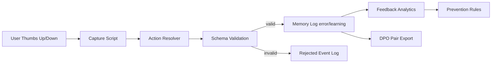

# RLHF Feedback Loop

[](https://github.com/IgorGanapolsky/rlhf-feedback-loop/actions/workflows/ci.yml)
[](LICENSE)
[](scripts/export-dpo-pairs.js)
[](docs/PLUGIN_DISTRIBUTION.md)

Production-grade RLHF operations for coding agents.
Capture thumbs-up/down feedback, enforce schema quality, prevent repeated mistakes, and export DPO-ready preference pairs.

## Why This Repo Exists

Most teams collect feedback but fail to convert it into durable behavior change.
This project closes that loop:

1. Capture explicit user feedback (`up/down`) with context.
2. Convert to typed `error/learning` memory.
3. Reject low-signal or vague input.
4. Generate prevention rules from repeated failures.
5. Export DPO preference pairs for model fine-tuning pipelines.

## What You Get

- Reliable feedback ingestion with schema validation boundaries.
- Immediate behavior constraints (mistake prevention rules).
- Local-first data model (privacy-friendly default).
- Portable integration templates for Claude, Codex, and Gemini.
- DPO JSONL export for offline training workflows.

## 60-Second Demo

```bash
# 1) run checks
npm test

# 2) capture negative feedback with prevention details
node .claude/scripts/feedback/capture-feedback.js \
  --feedback=down \
  --context="Claimed done without test evidence" \
  --what-went-wrong="No proof attached" \
  --what-to-change="Always run tests and show output before completion claims" \
  --tags="verification,testing"

# 3) capture positive feedback for behavior reuse
node .claude/scripts/feedback/capture-feedback.js \
  --feedback=up \
  --context="Fix passed and evidence was attached" \
  --what-worked="Evidence-first completion flow" \
  --tags="verification,fix"

# 4) view summary and prevention rules
npm run feedback:summary
npm run feedback:rules

# 5) export DPO pairs
npm run feedback:export:dpo
```

## Architecture



## Agent Integrations

| Agent Runtime | Ready-to-use Asset | Purpose |
|---|---|---|
| Claude | `plugins/claude-skill/SKILL.md` | Auto-capture thumbs feedback + session prevention loop |
| Codex | `plugins/codex-profile/AGENTS.md` | Enforce feedback capture and rule injection in coding sessions |
| Gemini | `plugins/gemini-extension/tool_contract.json` | Tool contract for `capture_feedback`, `feedback_summary`, `prevention_rules` |

See [docs/PLUGIN_DISTRIBUTION.md](docs/PLUGIN_DISTRIBUTION.md).

## Full RLHF Clarification

This repo delivers a complete **operational RLHF loop** for agent behavior.
It does not perform online gradient updates itself.
Instead it produces:

- immediate runtime controls (`prevention-rules.md`)
- high-quality training data (`dpo-pairs.jsonl`)

That makes it practical for teams shipping today.

## Data Outputs (Local by Default)

- `.claude/memory/feedback/feedback-log.jsonl`
- `.claude/memory/feedback/memory-log.jsonl`
- `.claude/memory/feedback/feedback-summary.json`
- `.claude/memory/feedback/prevention-rules.md`
- `.claude/memory/feedback/dpo-pairs.jsonl`

These paths are git-ignored.

## Use Cases

- AI coding copilots for internal engineering teams.
- Support/chat agents where repeat-error prevention matters.
- Multi-agent orchestration systems that need feedback quality gates.
- Teams building dataset flywheels for DPO/SFT retraining.

## Productization Path (Sellable)

- **Open-source core**: this repo.
- **Managed service layer**: API-backed feedback memory + dashboards.
- **Enterprise add-ons**: SSO, policy packs, audit logging, workspace isolation.
- **Commercial support**: custom onboarding and integration services.

## Contributing

Issues and pull requests are welcome.
If you are integrating this into a real agent product, open a discussion with your runtime and requirements.

## License

MIT

